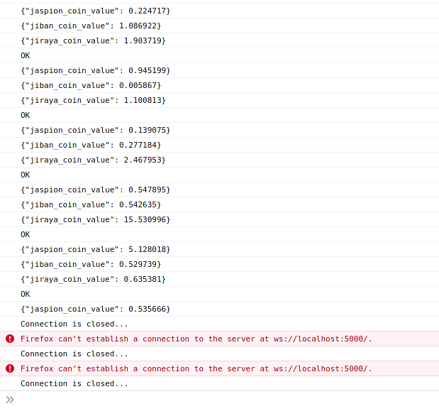

# Desafio frontend com websocket

## Requisitos de utilização

- docker
- docker-compose

## Requisitos da prova

0. criar um repositorio privado no github e me adicionar [sharkguto](https://github.com/sharkguto)
1. codificar o frontend usando vue.js 2 ou 3, e a framework de css que for familiar (bootstrap por exemplo)
2. criar testes unitarios com jest
3. renderização da tela em tempo real, com a biblioteca de charts que for mais familiar (echarts por exemplo)
4. Relatorio de 80% de cobertura de codigo
5. README auto-explicativo de como rodar seu frontend (se quiser fazer com docker , melhor ), e como executar o jest

## A prova

O exercicio proposto será voce criar um frontend responsivel, aonde terá que se conectar no websocket, que esta nesse projeto feito em docker. Os dados são de 3 criptomoedas muito volateis,
aonde se faz necessario armazenar em cache esses dados (vuex), e caso perca a conexão, continuar o grafico daonde parou.

segue exemplo de output do websocket:

[websocket.example.html](./devops/websocket.example.html)



## Execução do backend

```bash
docker-compose up --build
```
